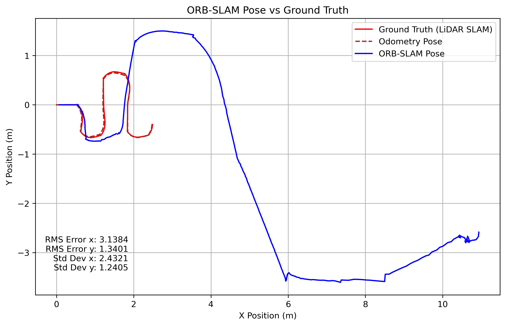

# Monocular ORB-SLAM3 on MBot: Challenges and Performance in Real Environments

**Po-Hsun Chang, Yu-I Chang, Jheng-Yi Lin**<br>
*University of Michigan – EECS 568 / ROB 530: Mobile Robotics*

---

**Abstract:**  
This project explores the implementation and performance evaluation of ORB-SLAM3 [1] on the University of Michigan’s MBot Classic [2] mobile robotics platform. ORB-SLAM3 is a state-of-the-art SLAM (Simultaneous Localization and Mapping) system that unifies visual, visual-inertial, and multi-session capabilities. We evaluate its performance in monocular-only configurations using real-world indoor datasets collected via an RGB camera. Data are formatted to match EuRoC [3] standards, enabling seamless integration with the SLAM framework.

---  

## How to use MBot for data acquisition

### 1. MBot Setup
 - 1.1 Clone the MBot repo
    ```bash
    $ mkdir mbot_ws
    $ cd mbot/mbot_ws/
    $ git clone https://github.com/yuic2000/mbot_orbslam.git
    ```
 - 1.2 Follow [this guide](https://rob550-docs.github.io/docs/botlab/mbot-system-setup-Pi5) to set up your MBot.

### 2. Run MBot in real-world environment
 - 2.1 Run LiDAR Slam
    ```bash
    $ cd mbot/mbot_ws/mbot_autonomy/build
    $ ./mbot_slam
    ```

 - 2.2 Record log file for data
    ```bash
    $ cd mbot/mbot_ws/mbot_dataset/
    $ lcm-logger [logFileName]
    ```

 - 2.3 Publish image data stream
    ```bash
    $ cd mbot/mbot_ws/mbot_vision/
    $ python3 mbot_image_publisher.py
    ```

 - 2.4 Start MBot motion controller
    ```bash
    $ cd mbot/mbot_ws/mbot_autonomy/build
    $ ./mbot_motion_controller
    ```

 - 2.5 Drive MBot through waypoints
    ```bash
    $ cd mbot/mbot_ws/mbot_autonomy/build
    $ ./drive_maze or ./drive_rec
    ```

### 3. Transform MBot data to ORB-SLAM spec
```bash
$ cd mbot/mbot_ws/mbot_dataset
$ python3 read_lcm_log_orbslam.py -f [path/to/logFile] -p [path/to/desried/datasetFolder]
```

## How to run ORB-SLAM3

### 1. ORB-SLAM3 Docker Setup
Follow [this guide](https://github.com/yuic2000/MBot_ORB-SLAM3_docker.git) to install ORB-SLAM3 Docker.

### 2. Run ORB-SLAM3 Docker Image
```bash
$ docker exec -it orbslam3 bash
```

### 2. Run ORB-SLAM3 using MBot dataset
```bash
$ cd /ORB_SLAM3/Examples
$ bash ./MBot_example.sh
```
### 3. Plot ORB-SLAM3 result
```bash
$ cd ORBSLAM3/Examples/ORBSLAM_MBot_data
$ python3 plot_ORBSLAM_pose3D.py -lidar [path/to/logFile] -orbslam [path/to/orbslam/result]
```

## Expected Final Output
 - Robot poses in 2D
 - ORB-SLAM3 estimated trajectory, ground truth from LiDAR-SLAM, and odometry pose
 - RMSE and STD analysis
<br>

Example: Rectangular Route
<div style="display: flex; justify-content: space-between;">
   
   
</div>
<br>
Example: Maze Route
<div style="display: flex; justify-content: space-between;">
   
   
</div>

## References
[1] C. Campos, R. Elvira, J. J. G´omez Rodr´ıguez, J. M. M. Mon-
tiel, and J. D. Tard´os, “ORB-SLAM3: An Accurate Open-Source
Library for Visual, Visual–Inertial, and Multimap SLAM,” IEEE
Transactions on Robotics, vol. 37, no. 6, pp. 1874–1890, 2021, doi:10.1109/TRO.2021.3075644, ORB-SLAM3 Github Repository: https://github.com/UZ-SLAMLab/ORB_SLAM3<br>
[2] University of Michigan MBot Documentation, available at: https://mbot.robotics.umich.edu/docs/<br>
[3] EuRoC Dataset, available at: https://projects.asl.ethz.ch/datasets/doku.php?id=kmavvisualinertialdatasets
